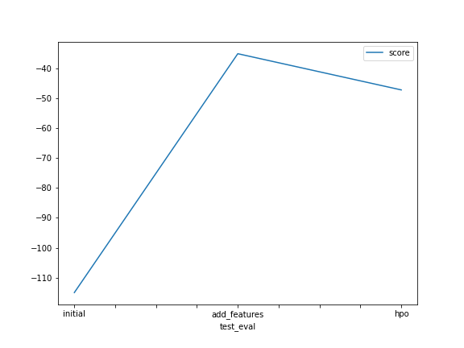

## Initial Training

### What did you realize when you tried to submit your predictions? What changes were needed to the output of the predictor to submit your results?

I noticed an error in submitting the result. I revised the error in kaggle and it was mentioned that the datetime column was missing.

### What was the top ranked model that performed?

The top model was WeightedEnsemble_L3

## Exploratory data analysis and feature creation

### What did the exploratory analysis find and how did you add additional features?

In EDA I draw a histogram for all the features to know the type of distribution it follows. I found that "atemp","temp" and "humidity" feature almost folows normal distribution.

I splitted the datetime feature into hour, day, year and month.

### How much better did your model preform after adding additional features and why do you think that is?

TODO: After adding the additional features, the RMSE decreased from 1.39 to 0.47.

## Hyper parameter tuning

### How much better did your model preform after trying different hyper parameters?

After i changed the hyperparameters i found the RMSE increased a little bit, which means that the combination I chose was not better than the previous one.

### If you were given more time with this dataset, where do you think you would spend more time?

I would consider spending more time in data cleaning and transformation. Also I would consider searching for a way to find the best combination of hyperparamters to achieve a better result.

### Create a table with the models you ran, the hyperparameters modified, and the kaggle score.

|   |        model | Time_limit | Verbosity | num_bag_folds |       score |
|--:|-------------:|-----------:|----------:|--------------:|------------:|
| 0 |      initial |        600 |         2 |          None | -114.937170 |
| 1 | add_features |        600 |         2 |          None |  -35.177782 |
| 2 |          hpo |        120 |         3 |             7 |  -47.267106 |

## Summary

In this project I started with importing data from Kaggle. After that, I performed EDA using histogram plots. I changed the type of "datetime" column to date time in order to be able to extract new features like hour, month, day and year.
I tested the performance of the model in three cases.

The first case is before adding new features. The second case is after adding the new features in which I found a great improvement in the score model. The last case is when I tuned the model's hyperparameters and that's also increased the model performance.

I plotted two figures to show the results for the three models in training and testing set.  

I would consider spending more time in data cleaning and transformation. Also I would consider searching for a way to find the best combination of hyperparameters to achieve a better result.

In conclusion, I learned the importance of feature engineering and hyperparameter tuning and how the affect the final result of the model.
